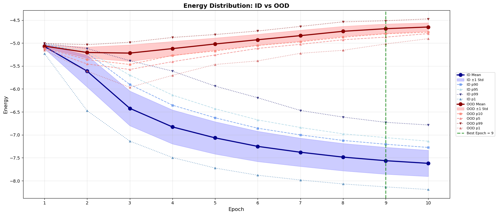
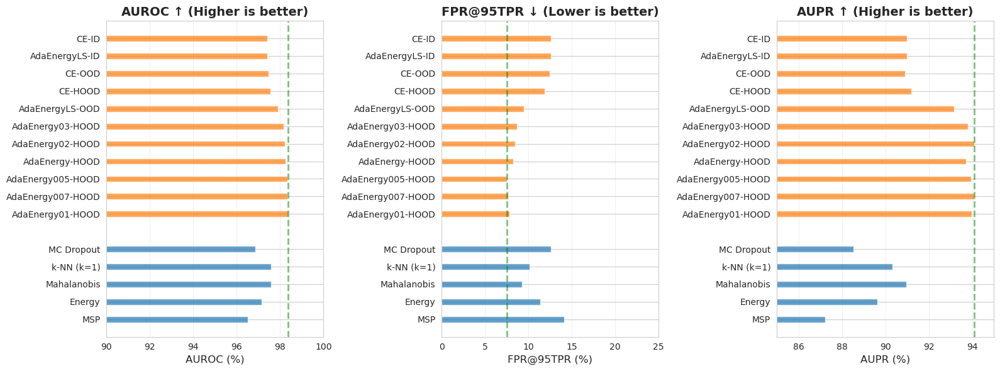
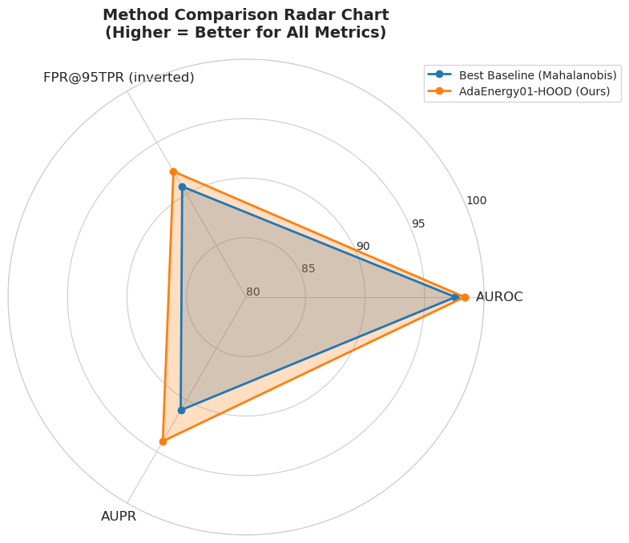

# AdaEnergy-HOOD: Energy-Based Fine-Tuning with Adaptive Margins for OOD Intent Detection

> **State-of-the-art *(for 30 may 2026)* OOD detection on CLINC150 with 98.35% AUROC and 7.80% FPR@95TPR — zero inference overhead!** 

## 📌 Overview

**AdaEnergy-HOOD** is a fine-tuning framework for out-of-domain (OOD) intent detection that combines cross-entropy with an **adaptive energy-based regularisation term**. Unlike post-hoc methods or Monte Carlo Dropout, our approach requires **no additional inference cost** — the energy score comes from a single forward pass.

### Key Innovations

- 🔄 **Dynamic Margins** — adapt to per-epoch energy statistics, eliminating manual tuning
- 📈 **Symmetric Ramp Schedule** — balances discriminative learning with energy separation
- 🎯 **Hard OOD Integration** — uses task-specific hard examples (no generative model)
- ⚡ **1× Inference Cost** — same as standard classifier (vs 20× for MC Dropout)

---

## 🏆 Results on CLINC150

| Method | AUROC ↑ | FPR@95TPR ↓ | AUPR ↑ |
|--------|---------|-------------|--------|
| **Published State of the Art** |
| Mahalanobis (Podolskiy 2021) | 96.76 | 18.32 | — |
| k-NN (Sun 2022) | 95.30 | 22.10 | — |
| **BERT-base-uncased Baselines (Danilo Malbashich 2026)** |
| MSP | 96.50 | 14.13 | 87.24 |
| Energy | 97.15 | 11.36 | 89.63 |
| Mahalanobis | 97.59 | 9.27 | 90.98 |
| k-NN | 97.58 | 10.13 | 90.33 |
| MC Dropout | 96.87 | 12.58 | 88.54 |
| **Our Methods** |
| **AdaEnergy01-HOOD** | **98.35** | **7.80** | **93.99** |
| **AdaEnergy005-HOOD** | **98.32** | **7.49** | **93.96** |
| AdaEnergy-HOOD | 98.24 | 8.27 | 93.73 |
| AdaEnergy02-HOOD | 98.21 | 8.47 | 94.10 |
| CE-HOOD | 97.55 | 11.87 | 91.20 |
| CE-OOD | 97.45 | 12.47 | 90.91 |

**Our best model beats state-of-the-art by +1.59 pp AUROC and -10.52 pp FPR@95TPR!**

---

## ⚡ Inference Speed Analysis

A key advantage of our approach is **zero inference overhead**. The OOD score $E(x)$ is computed directly from logits of a single forward pass.

### Theoretical Inference Cost

For a batch of $B$ samples with sequence length $L$, let $t_{\text{forward}}(B, L)$ be the time for a single forward pass through the BERT encoder and classification head. The table below compares the theoretical inference cost of different OOD detection methods.

| Method | Forward Passes | Additional Computation | Relative Time |
|--------|----------------|------------------------|---------------|
| Standard classifier (ID only) | 1 | None | $1\times$ |
| **AdaEnergy-HOOD (ours)** | **1** | **None (energy from logits)** | **$1\times$** |
| MSP / Energy (post-hoc) | 1 | Softmax / logsumexp | $1\times$ |
| Mahalanobis (post-hoc) | 1 | $\mathcal{O}(d^2)$ covariance + $\mathcal{O}(Cd)$ distance | $1\times + \delta$ |
| KNN (post-hoc) | 1 | $\mathcal{O}(Nd)$ distance + retrieval | $1\times + \Delta$ |
| MC Dropout ($T=20$) | 20 | Variance computation | $20\times$ |
| Deep Ensemble ($M=5$) | 5 | Ensemble averaging | $5\times$ |

where:
- $d = 768$ (BERT embedding dimension)
- $C = 150$ (number of intent classes)
- $N = 15,000$ (training set size for KNN)
- $\delta$ = small constant for matrix operations
- $\Delta$ = significant overhead for distance computations

**Unlike MC Dropout (20× slower) or ensembles (5× slower), our method adds zero inference overhead!**

